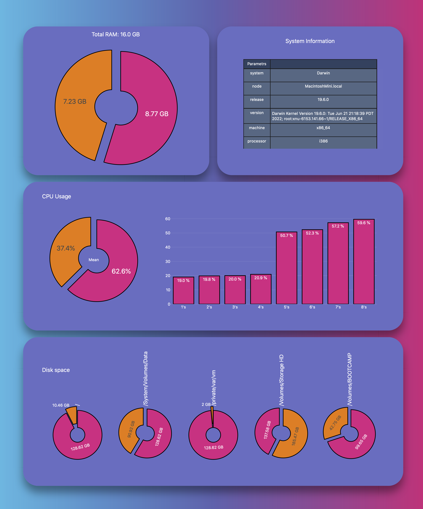

# Activity Monitor 

You can use this mini-app for remote viewing params of home-server.

> Before start run this command:
```sh
pip install -r r.txt
```

For run this app directly run command and follow terminal instuction:
```sh
python3 dash_app.py
```

## Preview

